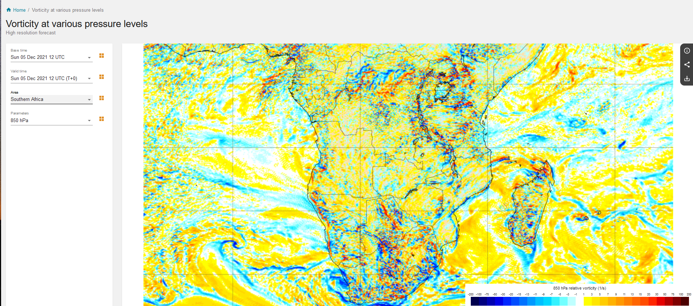
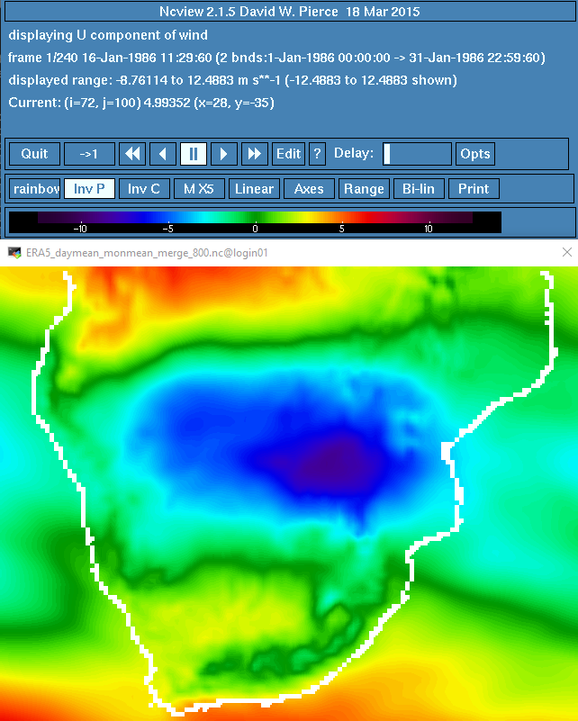

# Relative Vorticity

In a way, wind is in a continuous dance mode around the globe. Nonetheless, it is also performing a local dance, spinning around itself. In dynamic meteorology, this movement of the wind is described by a quantity termed as "relative vorticity". Briefly, relative vorticity is a measure of the spin of an air mass. 

## First Thoughts
 



  
## Theory

Theory is taken from the book <a href="https://www.amazon.com/Introduction-Dynamic-Meteorology-International-Geophysics/dp/0123848660"> "An Introduction to Dynamic Meteorology" </a> by James R. Holton and Gregory J. Hakim.\

According to them, "Vorticity, the microscopic measure of rotation in a fluid, is a vector field defined as the curl of velocity. The absolute vorticity  is the curl of the absolute velocity, whereas the relative vorticity  is the curl of the relative velocity:


which in Cartesian coordinates is analyzed to the following:


After performing scale analysis on the above equation, it appears that the horizontal components are negligible, and therefore only the vertical component is used, leading to the following equation for relative vorticity:

 


## Code
This tutorial is based on the <a href="https://unidata.github.io/MetPy/latest/index.html#"> MetPy </a> Python library and exploits the <a href="https://unidata.github.io/MetPy/latest/api/generated/metpy.calc.vorticity.html?highlight=vorticity#metpy.calc.vorticity"> vorticity </a> function. \
Before using the <a href="https://unidata.github.io/MetPy/latest/api/generated/metpy.calc.vorticity.html?highlight=vorticity#metpy.calc.vorticity"> vorticity </a> function, let's take a look at the code. <a href="https://github.com/Unidata/MetPy"> MetPy's repository </a> is openly accesible in Github, making our lives easier. If we move to the source code of the <a href="https://github.com/Unidata/MetPy/blob/main/src/metpy/calc/kinematics.py"> Kinematics </a> directory and look within lines 26-67, we will have a closer look of what happens within the function. 


```
def vorticity(u, v, *, dx=None, dy=None, x_dim=-1, y_dim=-2):
    r"""Calculate the vertical vorticity of the horizontal wind.

```
As we see, the <a href="https://unidata.github.io/MetPy/latest/api/generated/metpy.calc.vorticity.html?highlight=vorticity#metpy.calc.vorticity"> vorticity </a> function requires the U and V wind components as input. In addition, some information about the dx and dy is required, referring to the grid spacing on the Y and the x-axis.

```
dudy = first_derivative(u, delta=dy, axis=y_dim)
dvdx = first_derivative(v, delta=dx, axis=x_dim)
return dvdx - dudy
```

The key information is provided in lines 65-57. As we see, finite differences are calculated using the <a href="https://github.com/Unidata/MetPy/blob/9b01cbef28927a8fc70984807166b6f151f6990d/src/metpy/calc/tools.py#L952"> first_derivative </a> function. The <a href="https://github.com/Unidata/MetPy/blob/9b01cbef28927a8fc70984807166b6f151f6990d/src/metpy/calc/tools.py#L952"> first_derivative </a> function uses forward and backward differencing at the edges of the domain and central differences at every other part of the domain. We are reminded that in first order finite differencing, the following formulas are applied:

1. The one-sided (forward) difference:  

2. The one-sided (backward) difference:  

3. The central difference:  

The partial derivatives are then subtracted using the formula:  


## Hands-on

For this exercise we use the ERA5 reanalysis dataset, downloaded from the <a href="https://cds.climate.copernicus.eu/#!/home"> Copernicus Climate Data Store.  </a> For the calculation of relative vorticity we will need the U and V wind components. The region of interest is southern Africa and extends between latitudes from -10 to -35 S and between longitudes from 10 to 42 E.
Using the following command in a linux environment, we can see some attributes of the file we use and what preprocessing has taken place.

```
ncdump -h ERA5_daymean_monmean_merge_800.nc
```
We see the following:

```
dimensions:
        time = UNLIMITED ; // (240 currently)
        bnds = 2 ;
        longitude = 129 ;
        latitude = 101 ;
variables:
        double time(time) ;
                time:standard_name = "time" ;
                time:long_name = "time" ;
                time:bounds = "time_bnds" ;
                time:units = "hours since 1900-01-01 00:00:00.0" ;
                time:calendar = "gregorian" ;
                time:axis = "T" ;
        double time_bnds(time, bnds) ;
        float longitude(longitude) ;
                longitude:standard_name = "longitude" ;
                longitude:long_name = "longitude" ;
                longitude:units = "degrees_east" ;
                longitude:axis = "X" ;
        float latitude(latitude) ;
                latitude:standard_name = "latitude" ;
                latitude:long_name = "latitude" ;
                latitude:units = "degrees_north" ;
                latitude:axis = "Y" ;
        double u(time, latitude, longitude) ;
                u:standard_name = "eastward_wind" ;
                u:long_name = "U component of wind" ;
                u:units = "m s**-1" ;
                u:_FillValue = -32767. ;
                u:missing_value = -32767. ;
        double v(time, latitude, longitude) ;
                v:standard_name = "northward_wind" ;
                v:long_name = "V component of wind" ;
                v:units = "m s**-1" ;
                v:_FillValue = -32767. ;
                v:missing_value = -32767. ;

// global attributes:
                :CDI = "Climate Data Interface version 1.9.7.1 (http://mpimet.mpg.de/cdi)" ;
                :Conventions = "CF-1.6" ;
                :history = "Thu Nov 04 17:29:33 2021: cdo merge ERA5_u800_1986_2005_regionA_daymean_monmean.nc ERA5_v800_1986_2005_regionA_daymean_monmean.nc ERA5_daymean_monmean_merge_800.nc\n",
                        "Thu Nov 04 17:17:03 2021: cdo monmean ERA5_u800_1986_2005_regionA_daymean.nc ERA5_u800_1986_2005_regionA_daymean_monmean.nc\n",
                        "Thu Nov 04 17:13:32 2021: cdo daymean ERA5_u800_1986_2005_regionA.nc ERA5_u800_1986_2005_regionA_daymean.nc\n",
                        "Sun Oct 31 16:42:02 2021: cdo sellonlatbox,10,42,-35,-10 ERA5_u800_1986_2005.nc ERA5_u800_1986_2005_regionA.nc\n",
                        "Sun Oct 31 16:12:56 2021: cdo -b F64 -f nc2 mergetime ERA5_u800_1986_1998.nc ERA5_u800_1999_2005.nc ERA5_u800_1986_2005.nc\n",
                        "2021-10-31 03:41:27 GMT by grib_to_netcdf-2.23.0: /opt/ecmwf/mars-client/bin/grib_to_netcdf -S param -o /cache/data9/adaptor.mars.internal-1635647195.7786794-18405-5-3a45d373-0572-4b14-8ed9-085c098ef857.nc /cache/tmp/3a45d373-0572-4b14-8ed9-085c098ef857-adaptor.mars.internal-1635638913.5616663-18405-6-tmp.grib" ;
                :frequency = "mon" ;
                :CDO = "Climate Data Operators version 1.9.7.1 (http://mpimet.mpg.de/cdo)" ;
}

```
The file contains mean monthly data from 1986-2005 of U and V wind components at 800hPa.   



So, moving to the python code, we first have to load all packages and functions we will use. 

```
# 
from matplotlib import pyplot
from matplotlib.cm import get_cmap
from __future__ import print_function
from netCDF4 import Dataset,num2date,date2num
from matplotlib.colors import from_levels_and_colors
from cartopy import crs
from cartopy.feature import NaturalEarthFeature, COLORS
from metpy.units import units
from datetime import datetime
from metpy.plots import StationPlot
#
import metpy.calc as mpcalc
import xarray as xr
import cartopy.crs as ccrs
import matplotlib
import numpy as np
import matplotlib.pyplot as plt
import cartopy.feature as cfeature
#
```
We continue by setting our path:
```
root_dir = '/users/pr007/mkaryp/vorticity/'
```
And load in our NetCDF file:
```
nc = Dataset(root_dir+'ERA5_daymean_monmean_merge_850.nc')
```
#
lon=nc.variables['longitude'][:]
lat=nc.variables['latitude'][:]
#
dx, dy = mpcalc.lat_lon_grid_deltas(lon, lat)
#
u = []
v = []
vort = []
#
for i in range(240):
    v.append(np.array(nc.variables['v'][i,:,:]))                    
    u.append(np.array(nc.variables['u'][i,:,:]))
    v[i] = units.Quantity(v[i], 'm/s')
    u[i] = units.Quantity(u[i], 'm/s')
    vort.append(np.array(mpcalc.vorticity(u[i], v[i], dx=dx, dy=dy)))
    #
    print(i)
#
np.shape(vort)
#
#
```
    
<footer>
<p style="float:left; width: 100%;">
Copyright © Maria Chara Karypidou, 2021
</p>
</footer>


